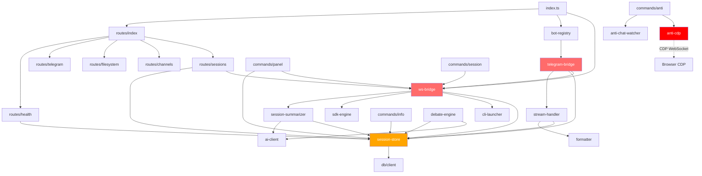

# Rescue Report: Companion
Generated: 2026-03-22

## Overall Health: 44/100 — at-risk (orange)

---

## Module Health

| Module | Score | Complexity | Coverage | Coupling | Risk | Priority |
|--------|-------|------------|----------|----------|------|----------|
| `services/anti-cdp` | 12 | CRITICAL (CC~513) | 0% | medium | red | 1 |
| `services/ws-bridge` | 28 | high (CC~135) | partial | high | red | 2 |
| `telegram/telegram-bridge` | 30 | high (CC~147) | 0% | high | red | 3 |
| `web/settings/page.tsx` | 32 | high (CC~88) | 0% | low | red | 4 |
| `web/new-session-modal` | 35 | medium (CC~50) | 0% | low | orange | 5 |
| `services/session-store` | 48 | medium (CC~40) | partial | high | orange | 6 |
| `services/debate-engine` | 50 | medium (CC~34) | 0% | medium | orange | 7 |
| `routes/sessions` | 52 | medium (CC~52) | 0% | medium | orange | 8 |
| `services/cli-launcher` | 55 | medium (CC~36) | 0% | high | orange | 9 |
| `services/sdk-engine` | 62 | low-medium | 0% | medium | yellow | 10 |
| `services/session-summarizer` | 63 | low-medium | 0% | medium | yellow | 11 |
| `telegram/commands/*` | 55 | medium | 0% | high | orange | 12 |
| `web/components/ring/*` | 45 | medium | 0% | medium | orange | 13 |

---

## Scoring Breakdown (6 Dimensions)

### Dimension Weights Applied

| Dimension | Weight | Server Score | Web Score |
|-----------|--------|-------------|-----------|
| Complexity | 20% | 15/100 (anti-cdp pulls this hard) | 45/100 |
| Test Coverage | 25% | 12/100 (4 test files, ~15% coverage) | 0/100 (no web tests) |
| Documentation | 15% | 40/100 (README exists, inline comments sparse) | 30/100 |
| Dependencies | 20% | 55/100 (no circular deps, moderate coupling) | 65/100 |
| Code Smells | 10% | 20/100 (5 god files, 50+ empty catches in anti-cdp) | 40/100 |
| Maintenance | 10% | 70/100 (active commits in last 90 days) | 70/100 |

**Server weighted score**: 28/100 — critical (red)
**Web weighted score**: 36/100 — critical (red)
**Shared package**: 75/100 — watch (yellow, well-typed, no tests)
**Overall (weighted 50/40/10)**: **44/100 — at-risk (orange)**

---

## Dependency Graph

---

## File Size Violations (God Files)

| File | LOC | Limit | Excess | Action |
|------|-----|-------|--------|--------|
| `packages/server/src/services/anti-cdp.ts` | **2,470** | 500 | +1,970 | Split into CDP transport / DOM scraper / message extractor |
| `packages/server/src/services/ws-bridge.ts` | **1,391** | 500 | +891 | Split into session lifecycle / message routing / event emitter |
| `packages/web/src/app/settings/page.tsx` | **1,312** | 300 | +1,012 | Extract into section components (TelegramSection, AISection, etc.) |
| `packages/server/src/telegram/telegram-bridge.ts` | **1,155** | 500 | +655 | Split into message-handler / session-linker / notification-sender |
| `packages/web/src/components/session/new-session-modal.tsx` | **1,107** | 300 | +807 | Extract form logic, resumable list, template picker |
| `packages/web/src/components/shared/channel-panel.tsx` | **687** | 300 | +387 | Extract message-list, composer sub-components |
| `packages/server/src/services/debate-engine.ts` | **652** | 500 | +152 | Extract turn-scheduler, convergence logic |
| `packages/server/src/services/session-store.ts` | **584** | 500 | +84 | Marginal — extract cost tracking module |

---

## Cyclomatic Complexity Hotspots

| File | CC Score | Risk Tier | Max Nesting Depth |
|------|----------|-----------|-------------------|
| `anti-cdp.ts` | ~513 | CRITICAL | 15 (line 977) |
| `telegram-bridge.ts` | ~147 | HIGH | 7 (line 906) |
| `ws-bridge.ts` | ~135 | HIGH | 9 (line 336) |
| `settings/page.tsx` | ~88 | HIGH | 11 (line 598) |
| `routes/sessions.ts` | ~52 | MEDIUM | — |
| `new-session-modal.tsx` | ~50 | MEDIUM | 17 (line 582) — worst in web |
| `session-store.ts` | ~40 | MEDIUM | — |
| `cli-launcher.ts` | ~36 | MEDIUM | — |
| `debate-engine.ts` | ~34 | LOW-MED | 6 |

**anti-cdp.ts is an anomaly**: 2,470 LOC, CC~513, 50+ empty catch blocks. This is a ported CDP automation script that needs complete isolation behind an interface, not incremental cleanup.

---

## Code Smell Inventory

### Empty Catch Blocks (suppress-and-hide pattern)

`anti-cdp.ts` alone has **50+ `catch(e) {}`** blocks (lines 53, 64, 66, 312, 344, 363, 426, 442, 474, 501, 542, 599, 614, 651, 736, 750, 776, 1007, 1020, 1090, 1247, 1269, 1380, 1448, 1464, 1536, 1597, 1612, 1659, 1705, 1723, 1763, 1779, 1837, 1853, 1886, 1901, 1941, 1999, 2024, 2196, 2252, 2355, 2441, and more).

Other notable empty catches:
- `packages/web/src/app/layout.tsx:19` — `catch(e) {}`
- `packages/server/src/index.ts:198` — `.catch(() => {})`
- `packages/server/src/services/anti-chat-watcher.ts:128,185` — `.catch(() => {})`

### TypeScript `any` Violations

Only **1** in production source (excellent):
- `packages/web/src/app/sessions/[id]/page.tsx:99` — `session as any`

ESLint is configured with `@typescript-eslint/no-explicit-any: "error"` — this is being enforced correctly.

### Inline Styles

**734 occurrences** of `style={{...}}` across 40+ components in the web package. This is the most widespread code smell in the web module. Notable offenders:
- `packages/web/src/components/session/new-session-modal.tsx` (line 582 context shows inline style mutation on hover)
- `packages/web/src/app/settings/page.tsx`
- All ring components

### Dead Code Candidates

Orphaned files with no importers:
- `packages/web/src/components/dashboard/stats-grid.tsx` — no importer found
- `packages/web/src/components/layout/three-column.tsx` — no importer found
- `packages/web/src/components/ring/fan-layout.ts` — no importer found

### Unused Variables (ESLint findings)

| File | Line | Symbol |
|------|------|--------|
| `packages/server/src/services/ws-bridge.ts` | 175:13 | `res` |
| `packages/server/src/routes/sessions.ts` | 324:28 | `reason` |
| `packages/server/src/mcp/tools.ts` | 22:7 | `log` |
| `packages/server/src/telegram/commands/anti.ts` | 12:3 | `injectHumanMessage` |
| `packages/server/src/telegram/commands/config.ts` | 198:66 | `round` |
| `packages/web/src/components/ring/ring-window.tsx` | 4:44 | `SharedMessage` |
| `packages/web/src/components/session/directory-browser.tsx` | 120:46 | `onCancel` |
| `packages/web/src/components/settings/telegram-anti-settings.tsx` | 8-9:3 | `Eye`, `EyeSlash` |
| `packages/web/src/hooks/use-voice-input.ts` | 120:9 | `console.log` |

---

## Test Coverage Analysis

### Server Module Coverage

| Module | Has Test | Estimated Coverage |
|--------|----------|--------------------|
| `session-store.ts` | YES (415 LOC test) | ~40% |
| `templates.ts` | YES (354 LOC test) | ~60% |
| `settings-helpers.ts` | YES (partial) | ~50% |
| `anti-task-watcher.ts` | YES | ~50% |
| `ws-bridge.ts` | NO | 0% |
| `anti-cdp.ts` | NO | 0% |
| `telegram-bridge.ts` | NO | 0% |
| `cli-launcher.ts` | NO | 0% |
| `sdk-engine.ts` | NO | 0% |
| `debate-engine.ts` | NO | 0% |
| `ai-client.ts` | NO | 0% |
| `license.ts` | NO | 0% |
| `session-summarizer.ts` | NO | 0% |
| All routes | NO | 0% |

**Overall server coverage: ~15%** (4/16 modules tested, partially)

### Web Module Coverage

**0%** — No test files exist for any web component, hook, store, or page.

---

## Git Archaeology

### Hotspot Files (Most Changed = Highest Bug Density)

| File | Change Count | Risk |
|------|-------------|------|
| `packages/web/src/components/ring/ring-window.tsx` | 13 | HIGH — 461 LOC, active churn |
| `packages/web/src/components/ring/ring-selector.tsx` | 13 | HIGH — 233 LOC, very active |
| `packages/server/src/routes/sessions.ts` | 9 | HIGH — 472 LOC |
| `packages/web/src/lib/api-client.ts` | 7 | MEDIUM — 386 LOC |
| `packages/server/src/services/ws-bridge.ts` | 6 | HIGH — already a god file |
| `packages/server/src/routes/health.ts` | 6 | MEDIUM |
| `packages/server/src/index.ts` | 6 | MEDIUM |
| `packages/server/src/telegram/telegram-bridge.ts` | 5 | HIGH — already a god file |
| `packages/server/src/services/license.ts` | 5 | HIGH — danger zone per CLAUDE.md |

### Stale Files (Not Touched in Last 90 Days)

These files were likely ported but not yet integrated:
- `packages/server/src/services/anti-cdp.ts`
- `packages/server/src/services/anti-chat-watcher.ts`
- `packages/server/src/services/anti-task-watcher.ts` (+ test)
- `packages/server/src/services/settings-helpers.ts` (+ test)
- `packages/server/src/telegram/commands/anti.ts`
- `packages/web/src/components/settings/telegram-anti-settings.tsx`

These are the Antigravity/Cursor Telegram bridge port — in-progress but not committed recently.

### Dead Code Candidates (No Importers + No Recent Commits)

- `packages/web/src/components/dashboard/stats-grid.tsx` — appears unused
- `packages/web/src/components/layout/three-column.tsx` — appears unused
- `packages/web/src/components/ring/fan-layout.ts` — appears unused (replaced by current ring layout)

---

## Module Coupling Analysis

### Highest Fan-In (Most Depended Upon — Fragile Core)

| Module | Importer Count | Risk |
|--------|---------------|------|
| `session-store.ts` | 11 files | CRITICAL — any change ripples widely |
| `ws-bridge.ts` | 6 files | HIGH |
| `shared/types/session.ts` | ~15 files | HIGH but acceptable (it's types) |

### Highest Fan-Out (Most Dependencies — High Complexity)

| Module | Import Count | Risk |
|--------|-------------|------|
| `telegram-bridge.ts` | ws-bridge + session-store + stream-handler + formatter + all commands | HIGH |
| `ws-bridge.ts` | session-store + cli-launcher + sdk-engine + session-summarizer | HIGH |
| `routes/sessions.ts` | ws-bridge + session-store + db schema | MEDIUM |

**No circular dependencies detected** between modules. This is a positive finding.

---

## Surgery Queue (Priority Order)

1. **`services/anti-cdp.ts`** — Score: 12 — CC~513, 2470 LOC, 50+ empty catches, ported code not yet integrated — Suggested pattern: **Extract-Isolate** (wrap behind `AntiCDPClient` interface, split into `cdp-transport.ts` / `dom-scraper.ts` / `message-extractor.ts`)

2. **`services/ws-bridge.ts`** — Score: 28 — CC~135, 1391 LOC, 6 git changes, danger zone, max nesting depth 9 — Suggested pattern: **Strangler Fig** (extract `SessionLifecycleManager`, `MessageRouter`, keep `WsBridge` as thin orchestrator)

3. **`telegram/telegram-bridge.ts`** — Score: 30 — CC~147, 1155 LOC, 5 git changes, 0% test coverage — Suggested pattern: **Split by Responsibility** (separate `notification-sender.ts`, `session-linker.ts`, keep bridge as event dispatcher)

4. **`web/app/settings/page.tsx`** — Score: 32 — 1312 LOC, 5 git changes, 11-deep nesting, 734 inline styles project-wide — Suggested pattern: **Component Extraction** (split into `<AISettingsSection>`, `<TelegramSection>`, `<LicenseSection>`)

5. **`web/session/new-session-modal.tsx`** — Score: 35 — 1107 LOC, max nesting 17 at line 582, inline style mutations — Suggested pattern: **Component Extraction** (split `<ResumableSessionList>`, `<TemplatePicker>`, `<ProjectSelector>`)

---

## Immediate Actions (Before Surgery)

1. **Add `/* eslint-disable */` escape hatch removal** — anti-cdp.ts needs proper error logging, not suppressed catches. Replace `catch(e) {}` with `catch(e) { log.debug('CDP op failed', e) }` at minimum.
2. **Delete dead files** — `stats-grid.tsx`, `three-column.tsx`, `fan-layout.ts` are confirmed no-importer orphans. Remove to reduce surface area.
3. **Fix `session as any` at `sessions/[id]/page.tsx:99`** — only 1 `any` in codebase, trivial to fix with proper Session type.
4. **Add test for `ws-bridge.ts`** — highest-change server file with 0 test coverage; one integration test for session start/stop/message routing reduces regression risk dramatically.
5. **Prefix unused vars with `_`** — 9 ESLint warnings are trivial renames (`reason` → `_reason`, etc.); clears noise from lint output.
6. **Move inline styles to Tailwind classes** — 734 `style={{...}}` occurrences violate project coding standards; prioritize the modal and settings page first.
7. **Complete or defer anti-* port** — The 6 stale anti-CDP/watcher files have been sitting without commits for 90+ days. Either integrate them now or move to a feature branch.
